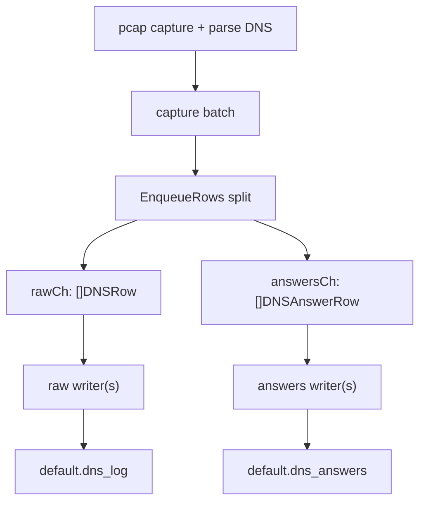

# dnsflowd Current Architecture

This document describes how `dnsflowd` works after the split ClickHouse sink
change. The goal is to keep Flow Explorer DNS enrichment fresh even when raw DNS
logging is under heavy load.

## Purpose

`dnsflowd` captures DNS packets from the mirror interface and writes two
ClickHouse datasets:

- `default.dns_log` - raw DNS query/response rows, used for audit/debug.
- `default.dns_answers` - flattened A/AAAA answer rows, used by Flow Explorer to
  enrich flows with `dns_name`.

Flow Explorer depends on `dns_answers`, not on the full raw `dns_log` backlog.
Because of that, `dns_answers` freshness is the primary health signal.

## Data Path



The important behavior is that `EnqueueRows` immediately derives
`DNSAnswerRow` values from every response row and tries to enqueue them into
`answersCh` independently from `rawCh`.

If the raw queue is slow or full, answers can still be written. This prevents an
old raw backlog from hiding fresh DNS answers from the UI.

## Queues And Writers

`dnsflowd` now has two independent ClickHouse pipelines:

- Raw pipeline:
  - queue: `rawCh`
  - writer loop: `runRawWriter`
  - table: `default.dns_log`
  - counters: `raw_queued`, `raw_written`, `raw_queue_drops`,
    `raw_insert_errs`, `raw_queue_depth_batches`

- Answers pipeline:
  - queue: `answersCh`
  - writer loop: `runAnswersWriter`
  - table: `default.dns_answers`
  - counters: `answers_queued`, `answers_written`, `answers_queue_drops`,
    `answers_insert_errs`, `answers_queue_depth_batches`

Legacy aggregate fields remain in logs for compatibility:

- `records_queued` and `records_written` track the raw pipeline.
- `queue_drops` is the sum of raw and answers drops.
- `insert_errs` is the legacy raw insert error counter.

## Runtime Configuration

Production defaults on `netflow`:

```env
DNS_CH_RAW_ENABLED=1
DNS_CH_ANSWERS_ENABLED=1
DNS_CH_RAW_BATCH_SIZE=20000
DNS_CH_ANSWERS_BATCH_SIZE=20000
DNS_CH_RAW_QUEUE_SIZE=65536
DNS_CH_ANSWERS_QUEUE_SIZE=262144
DNS_CH_RAW_WRITERS=1
DNS_CH_ANSWERS_WRITERS=2
DNS_CAPTURE_BATCH_SIZE=1000
DNS_CAPTURE_FLUSH_INTERVAL=100ms
DNS_CH_FLUSH_INTERVAL=1s
DNS_HEALTH_INTERVAL=1m
DNS_HEALTH_LAG_THRESHOLD=100000
```

UI-first overload mode:

```env
DNS_CH_RAW_ENABLED=0
DNS_CH_ANSWERS_ENABLED=1
DNS_CH_ANSWERS_WRITERS=4
```

Use UI-first mode when `dns_answers` freshness is at risk and raw audit logging
can be temporarily sacrificed.

## Systemic Protections (Auto Shed + Dedup)

### Automatic raw shed (default on)

When `DNS_CH_RAW_AUTO_SHED_ON_ANSWERS_LAG=1` and `answers_writer_lag_rows`
exceeds `DNS_CH_ANSWERS_LAG_SHED_THRESHOLD` (default `100000`), `dnsflowd`
stops enqueueing raw `dns_log` rows and logs:

```text
level=WARN msg="dnsflowd raw shed to protect answers"
```

Counters:

- `raw_shed_active` - raw enqueue paused.
- `raw_shed_due_answers_lag_total` - raw rows skipped due to shed policy.
- `raw_policy` - `best_effort`, `best_effort_shed_active`, or `disabled`.

Raw resumes after answers lag stays below `DNS_CH_ANSWERS_LAG_RECOVER_THRESHOLD`
(default `50000`) for `DNS_CH_RAW_SHED_RECOVER_COOLDOWN` (default `2m`).

This is the automatic equivalent of manual UI-first mode, without disabling raw
permanently in env.

### Answers dedup (default 60s)

Repeated `(client_ip, answer_ip, query_name, answer_type)` within
`DNS_CH_ANSWERS_DEDUP_TTL` are not enqueued again. Metrics:

- `answers_dedup_suppressed`
- `answers_dedup_emitted`

Set `DNS_CH_ANSWERS_DEDUP_TTL=0` to disable.

### Raw policy

Production uses **best-effort raw**: `dns_log` may be incomplete during peaks.
Durable disk spool for raw is not implemented; use auto shed or `DNS_CH_RAW_ENABLED=0`.

ClickHouse capacity queries: [`DNSFLOWD_CH_RUNBOOK.md`](DNSFLOWD_CH_RUNBOOK.md).

## Reading The Logs

Example healthy split-sink log:

```text
level=INFO msg="dnsflowd clickhouse" raw_enabled=true raw_queued=736100 raw_written=315259 raw_queue_drops=0 raw_queue_depth_batches=4450 raw_insert_errs=0 answers_enabled=true answers_queued=528340 answers_written=493195 answers_queue_drops=0 answers_queue_depth_batches=0 answers_insert_errs=0 records_queued=736100 records_written=315259 batches_ok=85 insert_errs=0 queue_drops=0
```

Interpretation:

- `answers_queue_drops=0` - no DNS enrichment rows are being lost.
- `answers_insert_errs=0` - ClickHouse writes for `dns_answers` are healthy.
- `answers_queue_depth_batches=0` - answers writer has caught up.
- `raw_queue_depth_batches=4450` - raw audit backlog exists, but it is isolated
  from `dns_answers`.
- `raw_queue_drops=0` - raw backlog has not overflowed yet.

This state is acceptable for Flow Explorer because answers are fresh even though
raw logging is still catching up.

## Health Degradation

`dnsflowd` emits:

```text
level=ERROR msg="dnsflowd health degraded"
```

Primary fields:

- `answers_queue_drops_delta > 0` - critical for UI, answers were dropped.
- `answers_insert_errs_delta > 0` - critical for UI, `dns_answers` inserts fail.
- `answers_writer_lag_rows > DNS_HEALTH_LAG_THRESHOLD` - answers backlog is too
  large.
- `raw_queue_drops_delta > 0` - raw audit loss, UI may still be OK.
- `raw_insert_errs_delta > 0` - raw `dns_log` insert failures.

Alerting should page on answers failures and warn on raw-only degradation.

## Freshness Check

Use `dns_answers` freshness as the UI health check:

```sql
SELECT
    toString(now('UTC')) AS now_utc,
    toString(max(ts)) AS max_ts,
    dateDiff('second', max(ts), now('UTC')) AS lag_sec,
    count() AS rows
FROM default.dns_answers
FORMAT PrettyCompact;
```

Current good example:

```text
now_utc             2026-05-21 10:01:51
max_ts              2026-05-21 10:01:48.245122
lag_sec             3
rows                90056603
```

Success criteria:

- `lag_sec < 60-120` under normal load.
- `answers_queue_drops_delta = 0`.
- `answers_insert_errs_delta = 0`.
- Flow Explorer returns rows with `dns_name`.

## Operational Decision Tree

If `answers_queue_depth_batches` is near zero and `lag_sec` is low:

- DNS enrichment is healthy.
- Raw backlog can be monitored separately.

If `answers_queue_depth_batches` grows but drops are still zero:

- Increase `DNS_CH_ANSWERS_WRITERS` to `4`.
- Watch `answers_writer_lag_rows` and `lag_sec`.

If `answers_queue_drops_delta > 0` or `lag_sec` grows above 120 seconds:

- Switch to UI-first mode:

```env
DNS_CH_RAW_ENABLED=0
DNS_CH_ANSWERS_ENABLED=1
DNS_CH_ANSWERS_WRITERS=4
```

- Restart `dnsflowd`.
- Confirm `dns_answers.lag_sec` returns below 60-120 seconds.

If only `raw_queue_depth_batches` grows:

- UI DNS enrichment can still be healthy.
- Decide whether raw audit completeness matters more than ClickHouse load.
- Options are to keep buffering, add raw writer capacity, or temporarily disable
  raw with `DNS_CH_RAW_ENABLED=0`.

